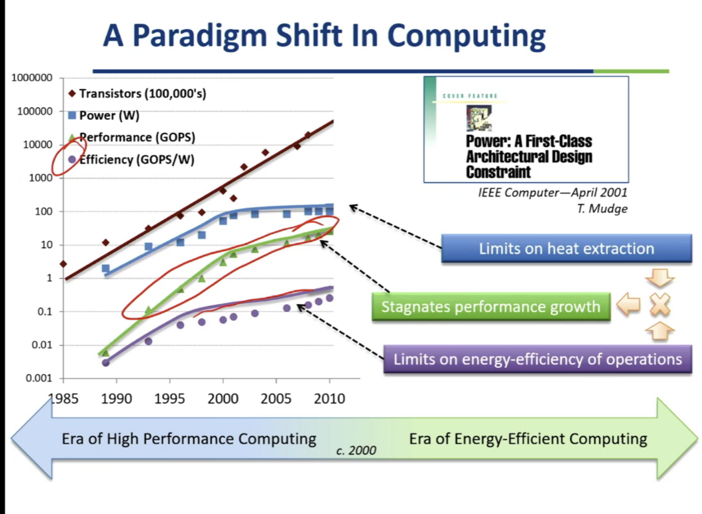
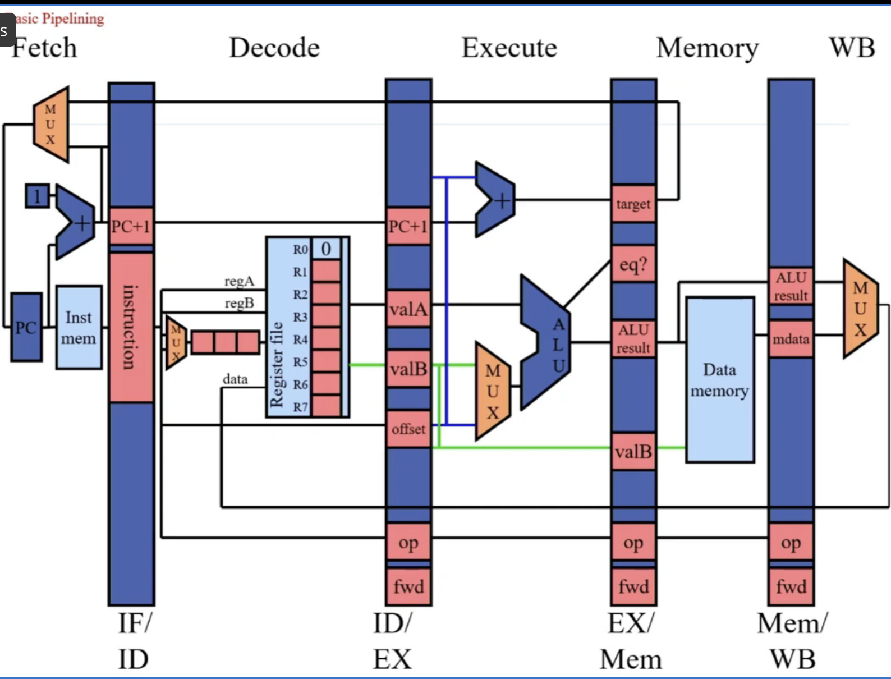

## Key concepts

# Amdahl's Law
- Speedup = time_without_enhancement / time_with_enhancement
- suppose an enhancement speed up a fraction f of a task by a factor of S:
    - time_new = time_original((1-f)+f/S)
    - S_overall = 1/((1-f)+f/S)

# Iron Law
Time/program = Instructions?program x Cysles/ Instruction x Time/Cycle

# Arithmeti time 
1/n * Sum Time_i

# Harmonic Rates
n/Sum1/Rate_i

# Parallelism
- the amount od independent subtasks available  

- work = T1 -> time to complete a computation on a sequential system
- critical path = T_inf -> time_to_complete_the_same_computation on a infinity parallel system  

- Average Parallelism = P_avg = T1/T_inf
- P wide system: T_p >= max{T_1/p,T_inf}  P-avg >> P  T_p = T_1/P

# Locality Principle
- Temporal Locality: We use recently we probably use it again
- Spatial Locality: We use something we probably use the near thing   
locality == patterns == predictability

# Memoization
cache: remember something expensive to compute

# Amortization
- overhead cost: one time cost
- per-unit cost: cost for per unit 
- total cost = overhead cost + N*per-unit cost
- **average cost** = total cost / N  

  

# Basic pipelining
1. 5 stages RISC load store architecture
    - instruction fetch
    - instruction decode
    - execute
    - memory
    - writeback
  

# Instruction Set Architecture
A contract between HW and SW  
interface  contract
- functional definition of operations, modes and storage locations supported by hardware
- precise description of how to invoke and access them

- CISC (complex instruction set computing)
- RISC (reduced instruction set computing)

- single cycle control
- multi cycle control

# Pipeline Hazards
- avoidance: add 3 noop 
- detect and stall: add 2 noop
- detect and forward: add 1 noop

# improve pipeline performance
- add more stages
    - fetch & decode: 
        - delay hazard detection
        - no change in forwarding path
        - no performance penalty with respect to data hazards
    - execute:
        - structural hazards
            - ALU not pipelined
            - multi ALU completing at the same time
        - data hazards
    - memory & writeback
        - instructions ready to execute may need to wait longer for multi-cycle memory stage
        - add more pipeline registers may be more complex

- widen pipeline

# IC Cost Equation
Die yield = f(defect density,die area)  

Die cost = Wafer cost / Dies x Die yield

IC cost = Die cost + TEst cost + packing cost / Final test yield  

