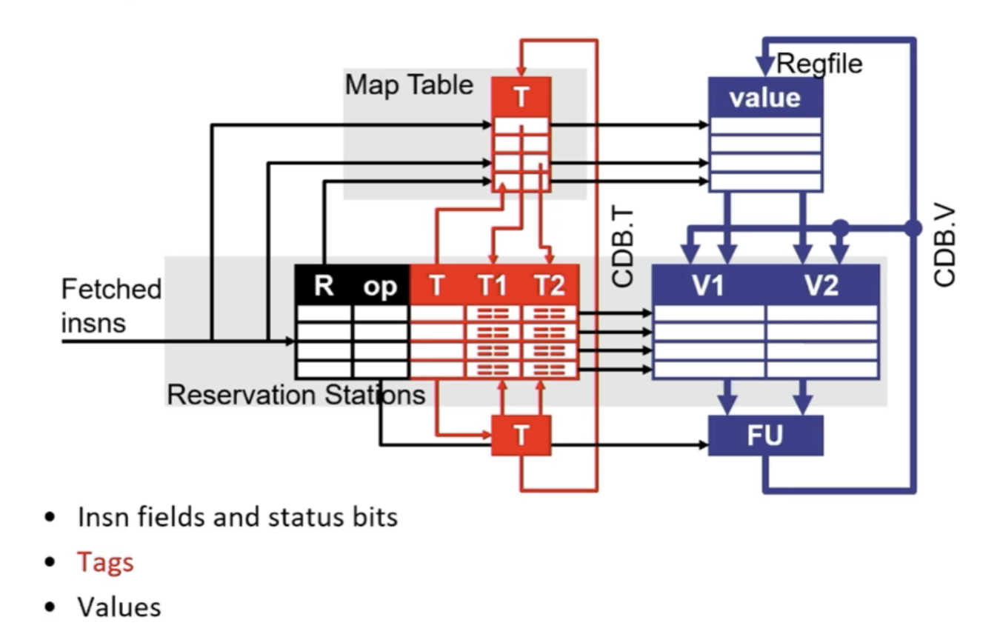
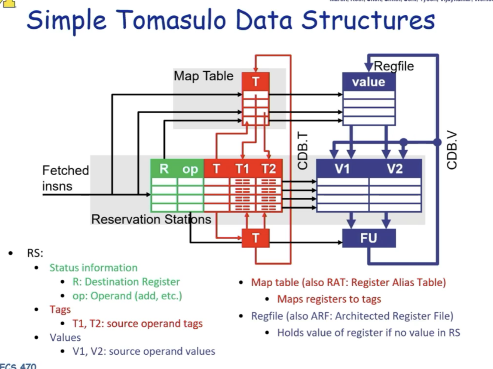

# Tomasulo's scheduling algorithm
**Tomasulo Data Structure**
- Reservation stations(RS) : instruction buffer
    - FU,busy,R: destination register name
    - T: register tag
        - T == 0:values is ready somewhere
        - T != 0: values is not ready,wait until CDB broadcasts T
    - T1 T2: source register tags
    - V1 V2:source register value
    - rename table/map table/rat:T:tag(RS#) that will write this register
- common data bus(CDB) : broadcast results to RS
    - <RS#,value> of completed insns
- Register renaming: removes WAR/WAW hazards  

   

