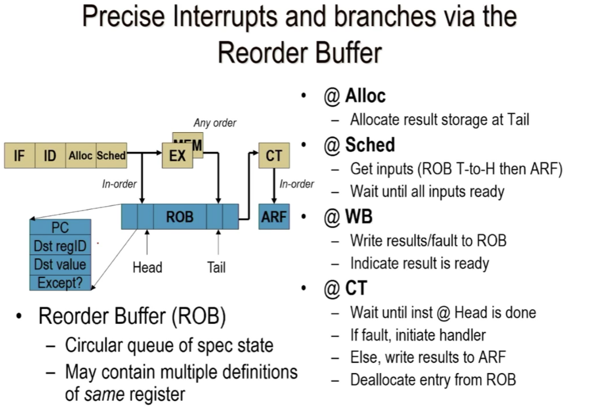
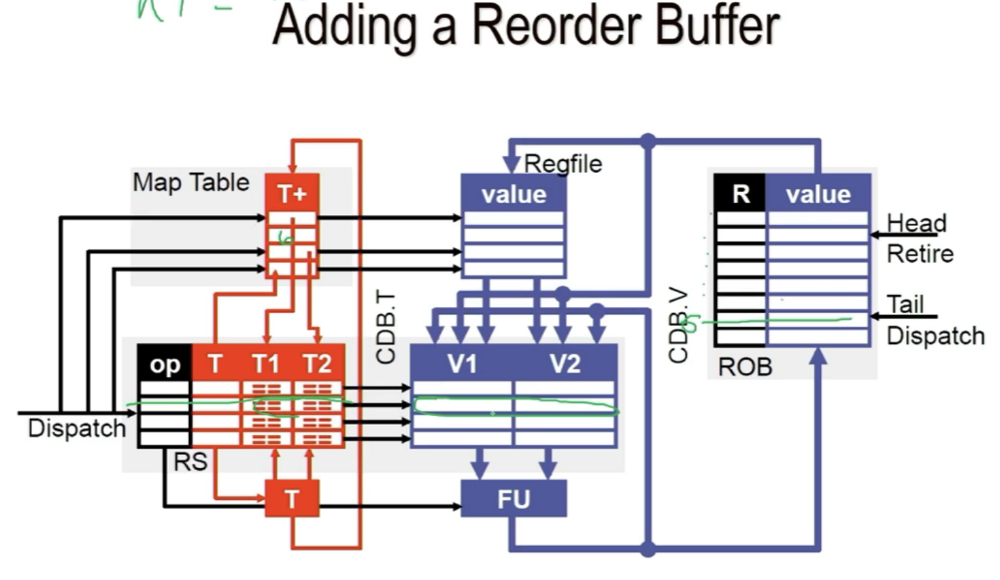

- 1-bit predictor:remember the last direction for a branch(Taken Nottaken)
- 2-bit predictor:  StronglyNottaken NotTaken Taken StronglyTaken

# Address Prediction
1. Branch Target Buffer
- predict target address during the fecth of the branch
2. RAS

# speculation
- control ~
- data ~
- memory conflict ~
- error ~

# ROB 
Record Buffer
- circular queue of spec state
- may contain multi defins of same register

ROB replace RS?
- ROB
    - in order queue where insns are places
    - insns complete in order
    - insns execute out of order
- still use RS
    - insns are issued to RS and ROB at the same time 
    - rename is ROB entry
    - when execute done insns leave RS

when a instruction is dispatched how does it impact each major structure?
- rename table
    - update my map table to my register numble
    - we don't touch register file , only do this when retire or commits
- ARF
    - nothing
- ROB 
    - put the insn into the ROB entry,insert into the queue, move the tail...
- RS
    - data is avalible? no, figure out the tag.   

When a instruction is complete execution how does it impact each major structure?
- rename table
    
- ARF
    - we don't touch register file , only do this when retire or commits
- ROB
    - there is a value in the ROB
- RS
    - mark this station done and anybody who is waiting on that value, get that in.

When a instruction retires how does it impact each major structure?
- rename table
    - update it if it is still pointing to the ROB number of yourself
- ARF
    - value for the ROB gets copied to the ARF
- ROB
    - move out that entry
- RS
    - nada

# optimize CPU preformance
t_CPU = N_inst * CPI * t_CLK
- the num of insns executed
- the cycles to execute an instruction(CPI)
- clock period  

our focus -> reduce CPI : Instruction level parallelism(ILP)

# ILP
- parallelism
- large window
- limited control deps
- eliminate false deps
- find run time deps

# How
- remove
    - the value field of ROB
    - the whole ARF
- add
    - a retirement RAT (RRAT)
    - a physical register file (PRF)

- lose the ARF
    - currently two structures that may hold values (ROB & ARF)
    - need to write back to the ARF after every instruction

# Resolving branches
RRAT : on mispredict at head of queue copy retirement RAT into RAT
- early resolution
    - BRAT: keep a RAT copy for each branch in a RS
        - if mispredict, can recover RAT quicklu
        - RUB easy to fix, RA bit harder
# Freedom
- when we rewrite RRAT is when we free it
- alive: a value is alive from when it is written to when it is last read